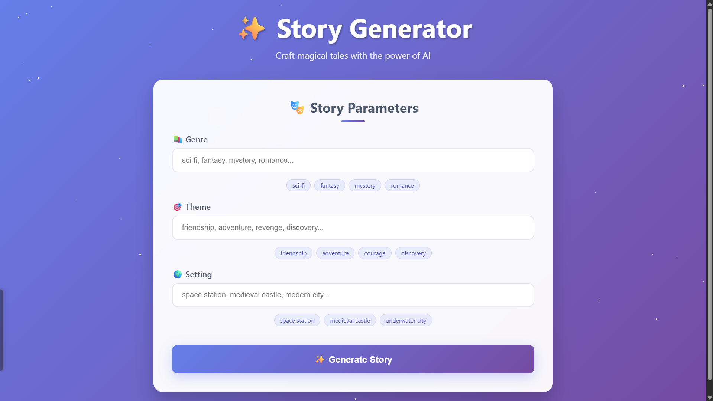

# ✨ AI Story Generator – Create Magical Tales Instantly

A beautiful and engaging AI-powered **Story Generator** that crafts compelling short stories based on user inputs: **genre**, **theme**, and **setting**. Perfect for writers, students, and creative minds seeking inspiration — all powered entirely on the frontend with [puter.js](https://developer.puter.com/).



---

## 🚀 Features

- 🎭 Enter your own **Genre**, **Theme**, and **Setting**
- ⚡ Instant story generation using **AI models via puter.js**
- 🔁 Streaming & fallback mechanism with error handling
- 📋 Copy stories with one click
- 📚 Read sample stories in case of AI failure
- ✨ Magical UI with animated stars and smooth gradients
- 💻 Fully **responsive design** – works great on mobile
- 🔒 100% client-side – **No sign-ups**, **No data saved**

---

## 🧠 Powered By

- [**puter.js**](https://developer.puter.com/): A JS library for client-side access to various AI models
- **HTML, CSS, JavaScript**: Clean and responsive UI
- **Creative Love** ❤️

---

## 📸 Screenshots

| Desktop View                        | Mobile View                       |
| ----------------------------------- | --------------------------------- |
|  |  |

---

## 💾 How to Use

1. Clone or download this repository.
2. Open the `index.html` file in your browser.
3. Enter a genre, theme, and setting.
4. Click **"✨ Generate Story"** and enjoy your AI-crafted tale.

> 💡 No backend or build tools required. Just static files!

---

## 🧩 Folder Structure

```
📁 AI-Story-Generator/
├── index.html        # Main HTML structure
├── style.css         # Custom CSS styles
├── script.js         # JavaScript logic (AI calls, UI actions)
```

---

## 🧪 Demo

👉 [Live Preview](https://ai-story-writer-free.netlify.app/)

---

## 🛠️ Customization

You can replace or update:

- The **AI model** used inside `script.js`
- The UI **theme, gradient, or font**
- The **sample stories** and fallback logic

---

## 🤝 Contributing

Contributions are welcome! Feel free to:

- Add new features
- Improve the UI/UX
- Add more sample stories

---

## 📄 License

This project is licensed under the **MIT License**.

---

## 🔗 Connect with Me

- 🌐 [Portfolio - MDSaifProgDev](https://mdsaifprog.space)
- 📚 [Project's Blog Post](https://blog.mdsaifprog.space/blog/ai-story-generator)
- 📷 [Instagram - @pheakz.iq](https://instagram.com/phreakz.iq)

---

> ✨ Built with curiosity, creativity, and coffee ☕ by **MD Saifullah**
